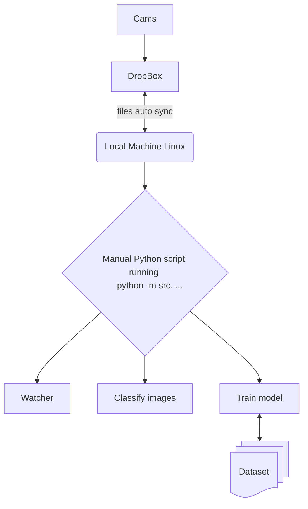

# Night Sky Image Classification & Object Detection

This project provides two machine learning capabilities:

1. **Image Classification**: Classify entire images into categories (fireballs, meteors, no_fireballs, etc.)
2. **Object Detection**: Detect and localize objects within images using Faster R-CNN with bounding boxes

The production-oriented UFOCapture cascade is isolated from both legacy paths.
See [UFOCapture Edge Fireball Triage](docs/UFOCAPTURE_EDGE.md) for its read-only
capture integration, external queue/state, ONNX runtime, and rollout gates.

## 🆕 Object Detection (NEW!)

Train a Faster R-CNN model to detect and localize objects in images. Perfect for identifying multiple objects in a single image with precise bounding boxes.

**Quick Start:**
- See [QUICKSTART_OBJECT_DETECTION.md](QUICKSTART_OBJECT_DETECTION.md) for a 5-minute guide
- See [OBJECT_DETECTION_README.md](OBJECT_DETECTION_README.md) for complete documentation

**Features:**
- Faster R-CNN with ResNet50 backbone
- Train from scratch on custom datasets
- YOLO format annotation support (via image-classification app)
- Comprehensive metrics: mAP, IoU, Precision, Recall
- Model export to ONNX and TorchScript

---

## Image Classification

This project uses a convolutional neural network (CNN) to classify images of the night sky into categories.

## Setup

1.  **Create and activate a virtual environment:**
    ```bash
    python3 -m venv venv
    source venv/bin/activate
    ```

2.  **Install dependencies:**

    *   **For common python libs**
        ```bash
        pip install -r requirements.txt
        ```

    *   **For systems with a compatible NVIDIA GPU:**
        ```bash
        pip install -r torch_requirements.txt
        ```

    *   **For systems with CPU only:**
        ```bash
        pip install -r torch_requirements_cpu.txt
        ```

## Usage

1.  **Train the model:**

    Place your training data in a directory (e.g., `training_data`) with subdirectories for each class (e.g., `fireballs`, `meteors`, `no_fireballs`, `lightnings`). Then run the training script:
    ```bash
    python -m src.train training_data
    OR
    python -m src.train_resnet18 training_data
    ```

    Set model name in config.py. 
    ```
        CLASSES = ['fireballs', 'meteors', 'no_fireballs', 'lightnings']
        CLASSES_SIZE = len(CLASSES)
        MODEL_PATH = 'night_sky_model_v11.pth' # used for main and watcher scripts
        TRAIN_MODEL_PATH = 'night_sky_model_v11.pth' # used to saved model file by train.py script
        RESNET18_MODEL_PATH = 'resnet18_trained_v1.pth' # used for main and watcher scripts
        RESNET18_TRAIN_MODEL_PATH = 'resnet18_trained_v1.pth' # used to saved model file by train.py script
        NUM_EPOCHS = 60
        BATCH_SIZE = 8
        LEARNING_RATE = 0.001
    ```
    

2.  **Classify a directory of images (one-time):**
    ```bash
    python -m src.main /path/to/your/images
    ```

3.  **Run the automatic watcher service:**

    To monitor a folder for new images and classify them automatically, run the watcher script. This will also send Telegram notifications for detected fireballs.

    **Before you start:** You must edit the `src/watcher.py` file and replace the placeholder values for `TELEGRAM_BOT_TOKEN` and `TELEGRAM_CHAT_ID` with your own credentials.

    ```bash
    python -m src.watcher /path/to/your/source_folder
    ```

## Building Executables

This project can be packaged into a single executable file using PyInstaller.

1.  **Install PyInstaller:**
    ```bash
    pip install pyinstaller
    ```

2.  **Build the executable:**

    The entry point for the executable is `run.py`. To build the watcher service, you will need to modify `run.py` to call `watcher.main()` instead of `main.main()`.

    ```bash
    pyinstaller --name classify_sky_watcher --onefile --add-data "night_sky_model.pth:." run.py
    ```

=======

## Run docker commands:

### Build the image and start services
`docker-compose build`
`docker-compose up`


Basic data flow diagram:

